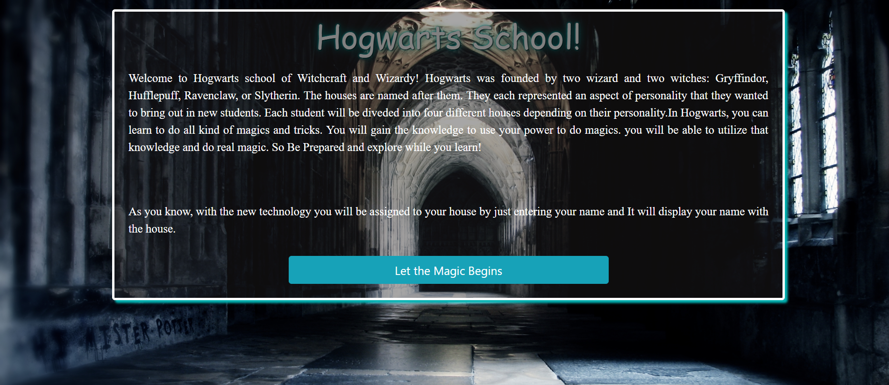
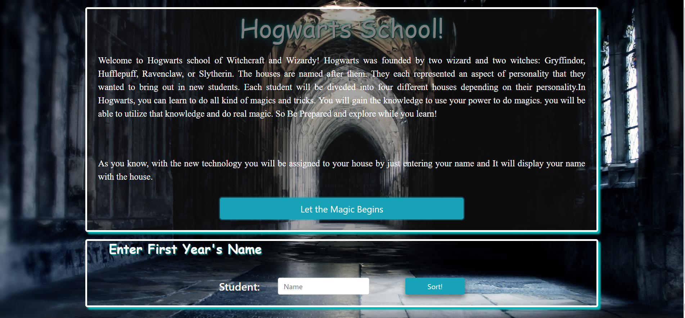
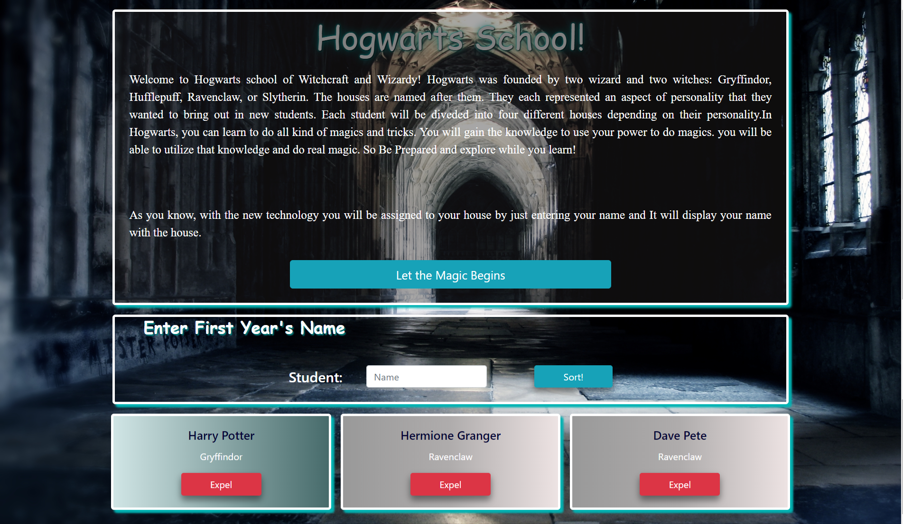
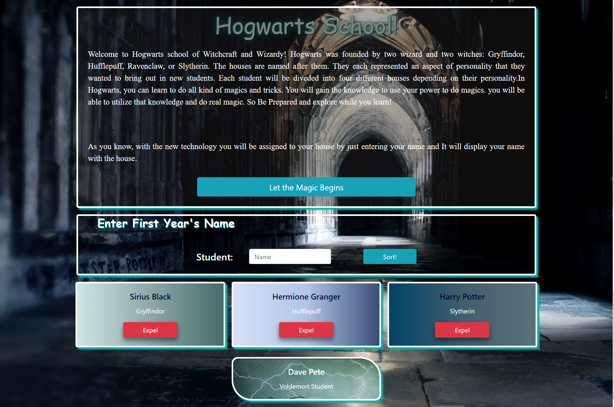

# Sorting Hat
This project is about bringing Hogwarts sorting hat to real life. On the website, it  provides introduction to Hogwart shcool and clicking let the magic begin, gives the first year student form. You need to enter Student name and sorting, it will display student card. It shows student card with name, house and Expel button. Please make sure to enter student Name otherwise it will display message on your screen.The color of the student's card changes depending on which house they were sorted. It organizes cards alphabatically by house. Also clicking on Expel, it deletes the student card and put it into voldemort's Army card.


## Screenshots
1. Website Introduction Page


2. Website Introduction Page with Student Form


3. Website with printed Student Card


4. Full Functional Website



## How to run this project
* Use npm to install http-server in your terminal:
```
npm install -g http-server
```
* Run the server
```
hs -p 9091
```
* Open chrome and navigate to :
```
localhost:9091
```
